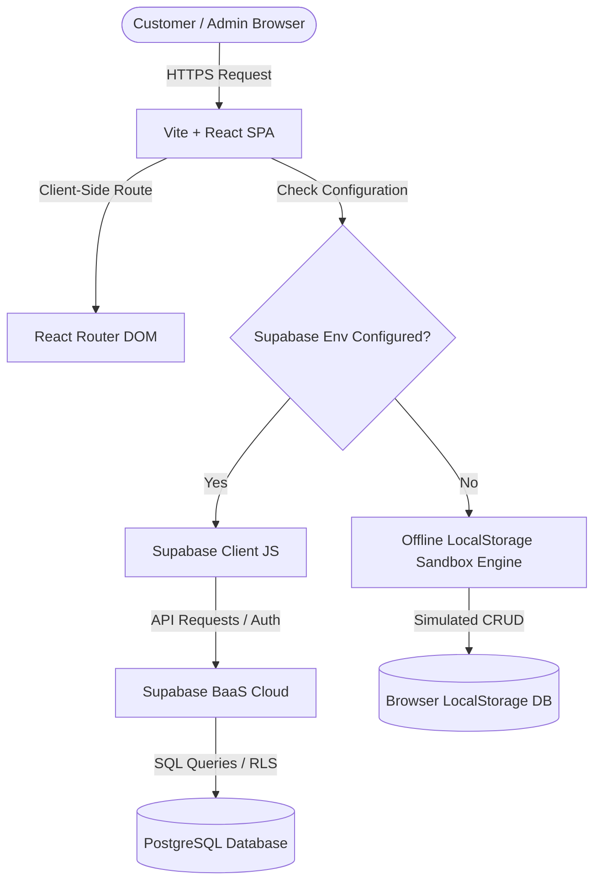
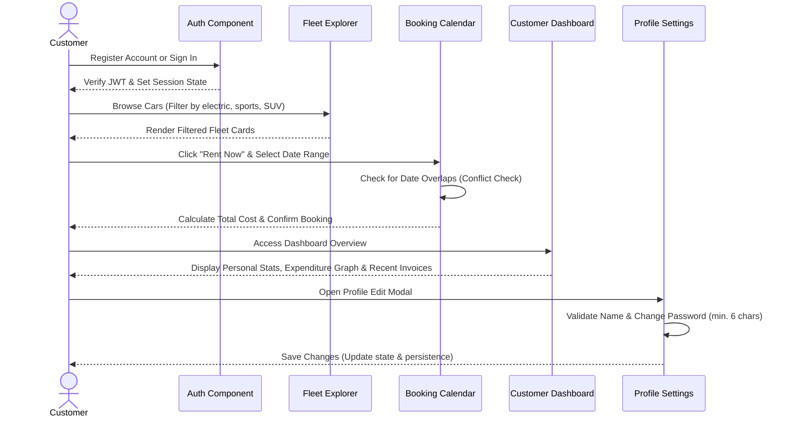
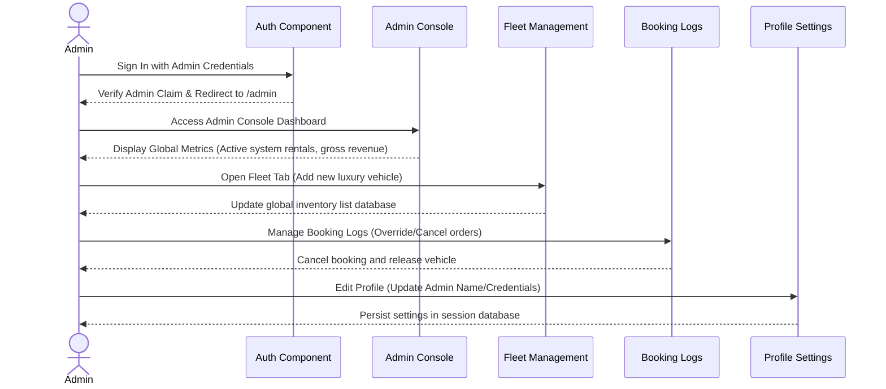

# Antigravity Car Rental System 🚗💨

A premium, state-of-the-art Car Rental Web Application designed with a sleek, modern UI, glassmorphic aesthetics, dual-theme support (Dark & Light modes), and a highly responsive user experience. 

This document serves as a comprehensive system specification, detailing the architecture, database schema, design elements, developer instructions, and distinct end-to-end workflows for both **Customers** and **System Administrators**. It is structured to serve as an academic or thesis reference manual for the application.

---

## 🏛️ System Architecture & Framework

The Antigravity Car Rental System employs a **Frontend + BaaS (Backend-as-a-Service)** architectural model. This decoupling removes the necessity of a traditional mid-tier server, optimizing response times and reducing operational latency.



### 1. Technology Stack
*   **Core Logic**: [React JS (v19)](https://react.dev/) using ES modules and functional hooks for component-level state and rendering lifecycle controls.
*   **Module Bundler**: [Vite JS](https://vitejs.dev/) to achieve near-instantaneous hot module replacement (HMR) and optimized build bundles.
*   **Styling Engine**: [Tailwind CSS (v4)](https://tailwindcss.com/) with native HSL CSS variables and custom utility classes.
*   **Animation Framework**: [Framer Motion](https://www.framer.com/motion/) for hardware-accelerated transitions, sliding drawers, and fading modals.
*   **BaaS Cloud Platform**: [Supabase](https://supabase.com/) hosting authentication, user metadata tables, PostgreSQL relational database instances, and row-level security policy sets.

### 2. Dual-Execution Engine (Supabase vs. Offline Sandbox Fallback)
To guarantee a zero-configuration developer onboarding process and robust deployment reliability, the system features a **Dual-Execution Engine**:
1.  **Online / Supabase Mode**: If valid credentials (`VITE_SUPABASE_URL` and `VITE_SUPABASE_ANON_KEY`) are detected in the environment variables, the system executes real-time operations, talking to the Supabase Cloud.
2.  **Offline / Sandbox Fallback Mode**: If environment variables are empty or missing, the application automatically mounts a simulated backend engine. This engine reads/writes mocks from the browser's `localStorage` (simulating user registrations, password updates, vehicle listing, booking overlays, and revenue charts), guaranteeing a fully operational sandboxed app environment.

---

## 🗄️ Database Schema & Relational Structure

The database layer is designed for PostgreSQL (deployed on Supabase). The schema enforces relational integrity constraints, automated triggers, and Row Level Security (RLS) policies to defend against unauthorized data mutation.

Refer to the database initialization script in [schema.sql](file:///C:/Users/admin/Desktop/Car%20Rental%20System/database/schema.sql).

### 1. Relational Table Specifications

#### Table: `public.cars`
Stores the catalog of premium luxury vehicles available in the rental fleet.
*   `id` (TEXT, PRIMARY KEY): A unique string identifying the car (e.g. `c_tesla_s`).
*   `make` (VARCHAR(100), NOT NULL): The vehicle manufacturer (e.g. `Tesla`).
*   `model` (VARCHAR(100), NOT NULL): The specific model name (e.g. `Model S Plaid`).
*   `type` (VARCHAR(50), NOT NULL): The vehicle category (e.g. `Electric`, `Sports`, `SUV`, `Hybrid`).
*   `fuel_type` (VARCHAR(50), NOT NULL, DEFAULT `'Gasoline'`): The propulsion system.
*   `seats` (INTEGER, NOT NULL, DEFAULT `5`): Maximum passenger seating capacity.
*   `price_per_day` (NUMERIC(10,2), NOT NULL): Base daily rental rate (in Rs).
*   `status` (VARCHAR(50), NOT NULL, DEFAULT `'available'`): Current operational status. Restricted via CHECK constraint to: `available`, `rented`, or `maintenance`.
*   `created_at` (TIMESTAMP WITH TIME ZONE, DEFAULT `NOW()`): UTC entry record timestamp.

#### Table: `public.bookings`
Manages vehicle reservations and tracks invoices.
*   `id` (TEXT, PRIMARY KEY): Unique alphanumeric booking identifier, auto-generated using a random MD5 hash suffix (prefixed by `'BK-'`).
*   `user_email` (VARCHAR(255), NOT NULL): Identifies the customer making the reservation.
*   `car_id` (TEXT, NOT NULL, REFERENCES `public.cars(id)` ON DELETE CASCADE): Foreign Key pointing to the rented vehicle.
*   `pickup_date` (DATE, NOT NULL): Start date of the reservation.
*   `return_date` (DATE, NOT NULL): End date of the reservation.
*   `total_price` (NUMERIC(10,2), NOT NULL): Calculated rental invoice amount.
*   `status` (VARCHAR(50), NOT NULL, DEFAULT `'confirmed'`): Reservation status. Checked against: `confirmed`, `cancelled`.
*   `created_at` (TIMESTAMP WITH TIME ZONE, DEFAULT `NOW()`): UTC transaction record timestamp.
*   *Constraints*: Evaluates `CHECK (return_date >= pickup_date)` to block illogical date ranges at the database layer.

### 2. Row Level Security (RLS) Configuration
Security policies are declared to ensure that authenticated users cannot access or edit other customers' reservations:
*   **Cars Catalog Access**: Open read access is granted to all anonymous and public users (`Allow public read access to cars`).
*   **Bookings Isolation**: Users are bound to policies that verify their JWT email claim (`auth.jwt() ->> 'email'`) against the booking's `user_email` field:
    *   `Allow users to read their own bookings`: Restricts queries to matches.
    *   `Allow users to insert their own bookings`: Verifies the record email matches the user's login.
    *   `Allow users to update their own bookings`: Permits cancellations only on personal bookings.

---

## 🎨 Design System & Theme Engine

The styling layer features a modern, high-contrast HSL color system that supports both dark and light modes.

### 1. Design Principles
*   **Glassmorphism**: UI surfaces (`card-glass`) use high-opacity slate backdrops (`rgba(15, 23, 42, 0.65)`) with saturation filters and thin semi-transparent white borders to mimic etched glass panels over glowing background shapes.
*   **Color Accents**: Cybernetic cyan (primary links), electric purple/indigo (buttons & interactive visualizer graphs), and vibrant coral (alerts & cancellation actions).
*   **Micro-Animations**: Buttons and cards transition elevation (`translate-y`), border glow color, and shadow opacity upon cursor hover.

### 2. Tailwind Inversion Engine (Dark/Light Modes)
To accommodate both Light and Dark modes without polluting JS files with ternary tailwind classes, the system implements a **CSS Variable Inversion Engine** inside [index.css](file:///C:/Users/admin/Desktop/Car%20Rental%20System/frontend/src/index.css):

```css
/* Dark Mode Theme Tokens (Default) */
:root {
  --color-bg-deep: hsl(222, 47%, 11%);
  --color-bg-surface: hsl(223, 47%, 16%);
  --color-text-main: hsl(210, 40%, 98%);
  --color-text-muted: hsl(215, 20%, 65%);
  --border-light: rgba(255, 255, 255, 0.08);
}

/* Light Mode Theme Tokens (.light Selector) */
.light {
  --color-bg-deep: hsl(210, 40%, 96%); /* Light cool gray */
  --color-bg-surface: hsl(210, 40%, 100%); /* Solid white card base */
  --color-text-main: hsl(222, 47%, 12%); /* Dark slate text */
  --color-text-muted: hsl(215, 15%, 45%); /* Medium slate text */
  --border-light: rgba(15, 23, 42, 0.08); /* Dark subtle lines */

  /* Tailwind Core Class Inversions */
  --color-white: hsl(222, 47%, 12%); /* text-white becomes dark slate */
  --color-black: hsl(210, 40%, 100%); /* text-black becomes white */
  
  /* Invert Slate Variables to swap backgrounds automatically */
  --color-slate-50: #020617;
  --color-slate-100: #0f172a;
  --color-slate-200: #1e293b;
  ...
  --color-slate-950: #f8fafc;
}
```
When a user toggles the theme, `ThemeContext` applies the `.light` class to the HTML tag, shifting all UI elements to the light theme instantly.

---

## 🔄 End-to-End System Workflows

The system separates workflows into two distinct operational scopes based on the authenticated user role.

### 👥 Customer (User) Workflow



1.  **Access & Authentication**:
    *   The user accesses the portal and authenticates via [Auth.jsx](file:///C:/Users/admin/Desktop/Car%20Rental%20System/frontend/src/pages/Auth.jsx).
    *   In Sandbox mode, signing in as `demo@example.com` / `password` accesses the premium guest profile.
2.  **Fleet Browsing**:
    *   On the [Cars.jsx](file:///C:/Users/admin/Desktop/Car%20Rental%20System/frontend/src/pages/Cars.jsx) catalog page, customers browse cars.
    *   They can filter by vehicle category type (SUV, Sedan, Electric, Sports) and sort listings dynamically by pricing.
3.  **Booking Creation**:
    *   The customer clicks on a car card, reviews structural specifications, and triggers the booking modal.
    *   They select date ranges using date pickers.
    *   The booking hook [useBookings.js](file:///C:/Users/admin/Desktop/Car%20Rental%20System/frontend/src/hooks/useBookings.js) runs a **Date Overlap Check** against existing reservations for that vehicle:
        $$\text{Overlap} = (P_{\text{start}} \le B_{\text{end}}) \land (P_{\text{end}} \ge B_{\text{start}})$$
    *   If no overlap is detected, it calculates total pricing (Daily Rate $\times$ Days), generates a booking, and adds it to the transaction history.
4.  **Dashboard Analytics & Management**:
    *   In the customer's personal [Dashboard.jsx](file:///C:/Users/admin/Desktop/Car%20Rental%20System/frontend/src/pages/Dashboard.jsx), the customer views:
        *   **Statistics Banner**: Displays count of active rides, total lifetime trips, and total amount spent.
        *   **Expenditure Graph**: A custom visualizer mapping the pricing metrics of their five most recent rentals.
        *   **Active Reservations**: Logs displaying vehicle details, rental dates, and pricing.
        *   **Cancellation controls**: Allows users to cancel confirmed bookings, changing booking status to `cancelled`.
5.  **Profile Update**:
    *   The user clicks **Edit Profile** in their dashboard banner.
    *   A glassmorphic editing form modal opens to change the display name and update the account password.
    *   Updates are saved via `updateProfile` in [AuthContext.jsx](file:///C:/Users/admin/Desktop/Car%20Rental%20System/frontend/src/context/AuthContext.jsx).

---

### 🛠️ Administrator Workflow



1.  **Secure Login**:
    *   The administrator signs in. In Sandbox Mode, this is simulated using `admin@example.com` / `password`.
    *   The system inspects authorization claims inside `useAuth()`. If validated as an admin, [MainLayout.jsx](file:///C:/Users/admin/Desktop/Car%20Rental%20System/frontend/src/layouts/MainLayout.jsx) automatically redirects them to the Admin portal at `/admin`.
2.  **Console Monitoring**:
    *   On the [Admin.jsx](file:///C:/Users/admin/Desktop/Car%20Rental%20System/frontend/src/pages/Admin.jsx) page, the administrator views system-wide statistics:
        *   **Active System Rentals**: Total count of active rentals across the platform.
        *   **Total System Trips**: Cumulative count of all bookings.
        *   **Gross Platform Revenue**: Total sum of all booking invoices, excluding cancelled ones.
3.  **Fleet Inventory Management**:
    *   The admin navigates to the **Fleet Management** tab:
        *   **Add Vehicle**: Fills a form to add a new car to the fleet (specifying make, model, category type, seats, daily price, and fuel system).
        *   **Remove Vehicle**: Clicks delete on any vehicle card, removing it from the database and automatically cascading cancellations to all associated bookings.
4.  **Booking Override Controls**:
    *   Under the **Booking Orders** tab, the admin views all active customer reservations.
    *   The admin has override privileges, allowing them to cancel any customer booking with a single click.
5.  **Admin Profile Customization**:
    *   By navigating to the `/dashboard` route, the administrator can click **Edit Profile** to change the administrator's display name and reset access passwords.

---

## 📂 Codebase Directory Mapping & File Roles

Below is the directory structure for the frontend React application under `frontend/src`:

```
frontend/src/
├── App.jsx            # Main App component wrapping context providers
├── main.jsx           # Application mount entry point
├── index.css          # Core CSS variables, Tailwind classes, and theme overrides
├── context/
│   ├── AuthContext.jsx    # User/Admin auth session state & profile updates
│   └── ThemeContext.jsx   # Dark/Light theme class selectors & persistence
├── hooks/
│   ├── useBookings.js     # Booking CRUD, overlap checks, and offline sync
│   └── useCars.js         # Cars catalog CRUD & inventory management
├── pages/
│   ├── Home.jsx           # Hero splash landing page & user reviews
│   ├── Cars.jsx           # Luxury fleet listing with category filters
│   ├── CarDetails.jsx     # Detail view for vehicles with specs
│   ├── Booking.jsx        # Date range reservation page
│   ├── Dashboard.jsx      # User/Admin statistics, invoices, and profile edit
│   ├── Admin.jsx          # Admin Console (Fleet & booking management)
│   └── Auth.jsx           # User registration and login portal
├── layouts/
│   ├── MainLayout.jsx     # Layout for standard pages & admin redirects
│   └── AuthLayout.jsx     # Layout for authentication screen
├── routes/
│   └── index.jsx          # React Router router declarations & protected routes
└── services/
    └── supabase.js        # Supabase client instantiation
```

---

## 💻 Developer Installation & Execution Guide

Follow these steps to configure the system locally:

### 📋 Prerequisites
*   [Node.js](https://nodejs.org/) (v18 or higher recommended)
*   [npm](https://www.npmjs.com/) (v9 or higher)

### 🚀 1. Clone & Install Dependencies
Navigate to the frontend workspace and install the package dependencies:
```powershell
cd "frontend"
npm install
```

### 🔑 2. Configure Environment Variables
Create a `.env` file in the root of the `frontend` folder. To run in **Offline Sandbox Mode**, you can leave the file blank or specify mock settings. To connect to **Supabase**, add the following keys:
```env
VITE_SUPABASE_URL=https://your-project-id.supabase.co
VITE_SUPABASE_ANON_KEY=your-supabase-anonymous-public-key
```

### 🛰️ 3. Initialize PostgreSQL Database (Supabase Mode Only)
If using Supabase, navigate to the SQL Editor in your Supabase Console, copy the schema definition from [schema.sql](file:///C:/Users/admin/Desktop/Car%20Rental%20System/database/schema.sql), and run the script. This will set up the tables (`cars`, `bookings`), constraints, RLS policies, and seed the initial fleet catalog.

### 🖥️ 4. Start the Local Development Server
Launch the development server:
```powershell
npm run dev
```
The application will run locally at **[http://localhost:5173/](http://localhost:5173/)**.

### 📦 5. Build for Production
To bundle and optimize the application for deployment:
```powershell
npm run build
```
The compiled output will be generated inside the `dist/` directory, ready to be deployed to Vercel or Netlify.
